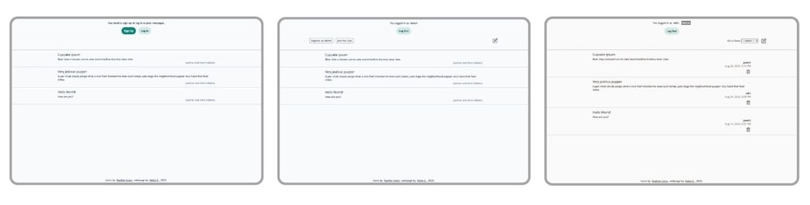

# The Odin Project: Members Only

 
  

      
  

 

 

This **Members Only** project was built to practice authentication with **Passport.js**, securing password with **bcrypt.js**, and managing data with **PostgreSQL**.

For the full assignment details, please visit [The Odin Project - Members Only](https://www.theodinproject.com/lessons/node-path-nodejs-members-only).

## Key Project Instructions

The project was developed following these main guidelines:

**Database design:**  

1. Users: first name, last name, password membership status, and admin status.
2. Messages: title, text, timestamp, and author.

**Data management:**  
Use `postgreSQL` to create and manage the above data tables.

**Forms and features:**  

1. Sign-up form: 
   - Sanitize and validate input.
   - Hash passwords with `bycrypt`.
2. "Join the Club" form: 
   - Include a passcode field.
   - Upgrade a membership status when the passcode is correct so users can see message authors and timestamps.
3. Log-in form:  
   - Authenticate users with `Passport.js`.
4. "Create a New Message" form: 
   - Allow only logged-in users to post messages.
5. Home page:  
   - Display all messages.
   - Mask authors and timestamps for non-members.
6. Admin operations: 
   - Provide a way to grant admin status (via a secret code form or a checkbox on sign-up).
   - Add a boolean field to track admin status in the database.
   - Show a delete button next to each message for admins and implement the delete functionality.
   - Add admin-only pages to view all the data and delete selected message .

**Deployment:** 

Host the app using a PaaS.

## Built With

- Express
- EJS
- PostgreSQL
- Passport.js (with passport-local)
- bycript.js
- HTML
- CSS
- JavaScript
- Dotenv
- ESLint
- Prettier
